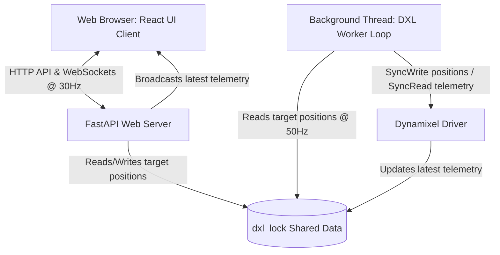

# LeapVisionController - System Architecture & Operation

This document provides a detailed explanation of the internal software architecture, kinematic mappings, computer vision pipeline, and communication stack used in the LEAP Hand control application.

---

## 1. Software Architecture & Communication Stack

The application is structured into four main components: the **React Web UI (Browser)**, the **FastAPI Middleware Server**, the **Kinematic Pose Mapper**, and the **Dynamixel Driver**. 

To maintain real-time telemetry streaming (30 Hz) while driving serial motor controls at a high frequency (50 Hz), the architecture uses an asynchronous and multi-threaded design:

### Threads and Concurrency
* **Asynchronous Server Loop (FastAPI/Uvicorn)**: Handles incoming client HTTP connections and WebSocket streaming. A dedicated `telemetry_broadcast_loop` task broadcasts the system status to the React interface at 30 Hz.
* **DXL Worker Thread (`_dxl_worker_loop`)**: A dedicated OS thread inside `RobotManager` running at 50 Hz. It polls target positions, executes low-level write commands to the hardware, reads physical position/current draw from the servos, and verifies safety checks.
* **Mutual Exclusion (`dxl_lock`)**: A threading mutex protecting shared telemetry data and target positions from race conditions between the server event loop and the background worker thread.

---

## 2. Computer Vision & Landmark Detection

The application uses **MediaPipe Hand Landmarker** (`vision.HandLandmarker`) to perform real-time tracking of hand skeletons from the webcam feed.
* MediaPipe detects **21 3D joint landmarks** (wrist, 4 joints per finger, and 4 joints for the thumb).
* Points are extracted as normalized coordinates: $x, y$ (representing position in the image plane) and $z$ (representing depth relative to the wrist).
* Normalization prevents distance variations from distorting joint curl measurements.

---

## 3. Kinematic Joint Mapping (Pose Mapping)

The core translation of 3D landmarks into Dynamixel servo ticks (0-4095) happens in `PoseMapper` using mathematical joint mapping:

### A. Finger Curl (Flexion/Extension)
For index, middle, and ring fingers, the overall flexion/extension is calculated by comparing the straight-line distance from the MCP joint to the finger TIP against the total joint-to-joint length of the finger:

$$\text{curl\_ratio} = \frac{\|\mathbf{p}_{\text{Tip}} - \mathbf{p}_{\text{MCP}}\|}{\|\mathbf{p}_{\text{PIP}} - \mathbf{p}_{\text{MCP}}\| + \|\mathbf{p}_{\text{DIP}} - \mathbf{p}_{\text{PIP}}\| + \|\mathbf{p}_{\text{Tip}} - \mathbf{p}_{\text{DIP}}\|}$$

* This ratio is clipped between a straight hand ($\approx 1.0$) and a curled fist ($\approx 0.3$).
* The normalized curl value ($0.0 \rightarrow 1.0$) is linearly interpolated to the calibrated joint limits:
  $$\text{target\_tick} = \text{limit\_min} + \text{curl\_val} \times (\text{limit\_max} - \text{limit\_min})$$

### B. Signed Thumb Abduction (Sweep)
Standard distance metrics make the thumb sweep symmetrical (causing it to wrap then unwrap as it crosses the palm). We project the thumb tip along the palm's lateral axis (vector from **Index MCP** to **Pinky MCP**) to obtain a signed direction:

$$\text{v\_lateral\_dir} = \frac{\mathbf{p}_{\text{Pinky\_MCP}} - \mathbf{p}_{\text{Index\_MCP}}}{\|\mathbf{p}_{\text{Pinky\_MCP}} - \mathbf{p}_{\text{Index\_MCP}}\|} \quad , \quad \mathbf{v}_{\text{thumb}} = \mathbf{p}_{\text{Thumb\_Tip}} - \mathbf{p}_{\text{Index\_MCP}}$$

$$\text{norm\_proj} = \frac{\mathbf{v}_{\text{thumb}} \cdot \text{v\_lateral\_dir}}{\|\mathbf{p}_{\text{Pinky\_MCP}} - \mathbf{p}_{\text{Index\_MCP}}\|\|}$$

* This yields negative values when the thumb is spread wide, and positive values when it crossed inward.
* The physical motor rotation is inverted for abduction ($1.0 - \text{thb\_abd}$) to align theOpposition and Spread directions correctly.

### C. Decoupled Thumb Flexion
In a human hand, the thumb MCP joint does not curl inward when making a fist; it stays extended/straight to wrap on the side of the fingers. To capture this, the thumb mapping decouples the MCP flexion from the PIP/DIP flexion:

1. **Thumb MCP Curl** is calculated from the CMC-MCP-IP segment ratio:
   $$\text{mcp\_ratio} = \frac{\|\mathbf{p}_{\text{IP}} - \mathbf{p}_{\text{CMC}}\|}{\|\mathbf{p}_{\text{MCP}} - \mathbf{p}_{\text{CMC}}\| + \|\mathbf{p}_{\text{IP}} - \mathbf{p}_{\text{MCP}}\|}$$
   * Mapped to **Motor 13 (Thumb MCP)**, keeping it straight ($2048$) in a fist.

2. **Thumb PIP/DIP Curl** is calculated from the MCP-IP-Tip segment ratio:
   $$\text{ip\_ratio} = \frac{\|\mathbf{p}_{\text{Tip}} - \mathbf{p}_{\text{MCP}}\|}{\|\mathbf{p}_{\text{IP}} - \mathbf{p}_{\text{MCP}}\| + \|\mathbf{p}_{\text{Tip}} - \mathbf{p}_{\text{IP}}\|}$$
   * Mapped to **Motor 14 (Thumb PIP)** and **Motor 15 (Thumb DIP)**, curling fully ($3200$) in a fist.

---

## 4. Gesture Classification & Presets Snapping

Landmarks are classified into specific posture categories at every frame:
* **Pinch**: Index and thumb tips close together, others curled.
* **Thumbs Up**: Thumb straight, all other fingers curled.
* **Making One**: Index finger straight, all others curled.
* **Scissors**: Index and middle fingers straight, others curled.
* **Closed Fist**: All fingers curled.
* **Open Hand**: All fingers straight.
* **Tiger Claw**: All fingers partially curled (claw shape) and spread out.

If **Auto-Gesture Snapping** is active, a successful classification overrides the real-time coordinates, instantly writing predefined preset targets to the motors. This prevents noisy camera jitters and produces solid robotic postures.

---

## 5. Dynamixel Communication Stack

The Dynamixel interface utilizes Protocol 2.0 and communicates with ROBOTIS XC330 series servos:
* **Operating Mode 5 (Current-Based Position Control)**: Combines position profiling with an active current threshold. If the hand collides with an obstacle or wraps too tightly, current spikes are capped to protect the motors and mechanical linkages.
* **GroupSyncWrite**: Bundles target goals into a single packet, allowing the application to write to all 16 motors simultaneously rather than issuing sequential commands, eliminating write latency.
* **GroupSyncRead**: Reads actual positions, current draws, and error statuses of all servos synchronously, maintaining loop integrity.
